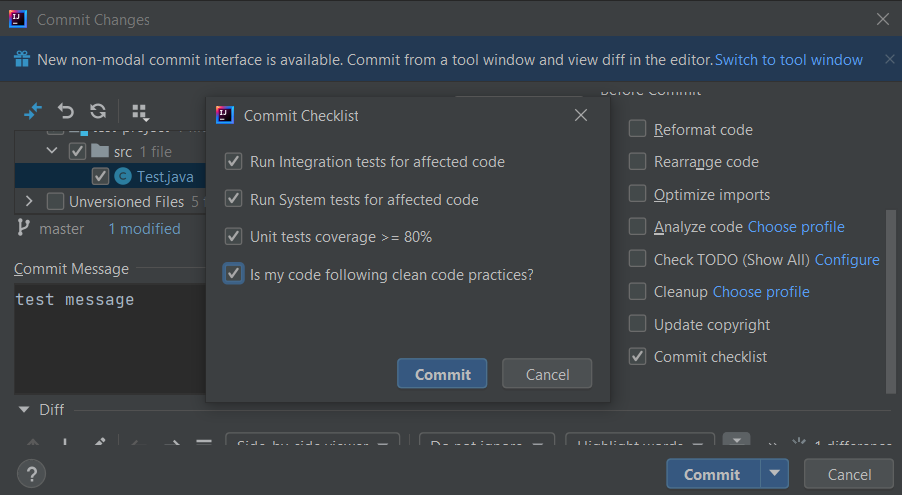
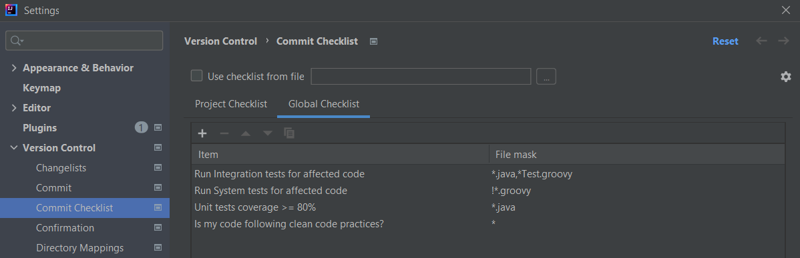

# Commit Checklist Plugin

Commit Checklist Plugin is a plugin for JetBrains IntelliJ IDEA, that can be used as a reminder for items that need to be fulfilled before committing changes.

It comes in the middle of committing changes process and lets you proceed with the commit only if you select all the items that you have in your checklist

You can define your own checklist in Settings > Version Control > Commit Checklist

